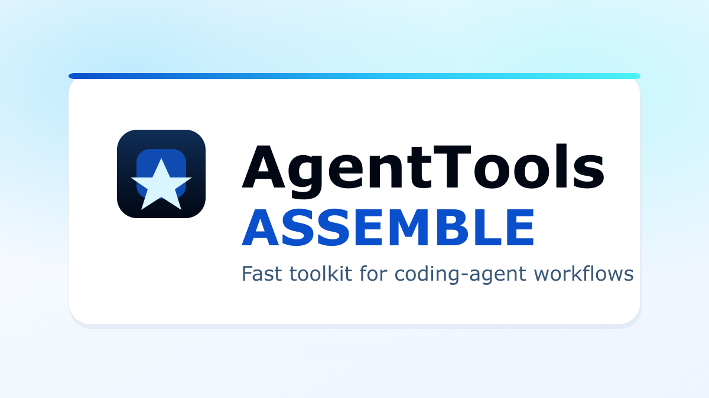
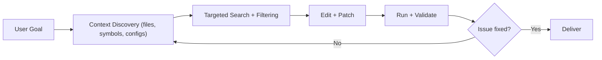
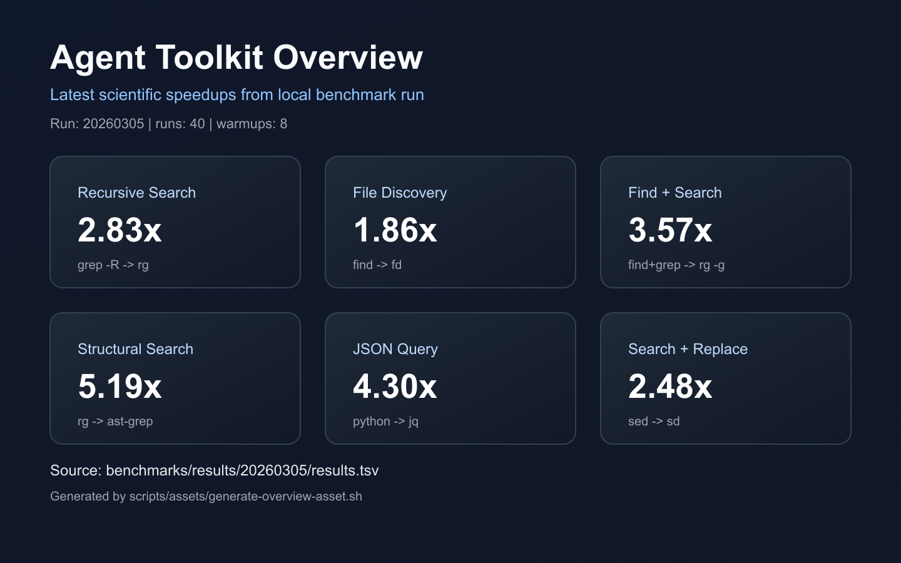

# Agent Toolkit

<p align="center">
  
</p>

**A high-performance local toolchain for coding agents.**  
When LLM agents work on real repositories, they spend most of their time in repeated local loops: discover files, search code, parse config, diff output, and validate changes. This project gives those loops faster primitives.

---

## Start in 60 Seconds

LLM quick onboarding (knowledge-first, no install required):

1. Load [skills/SKILL.md](./skills/SKILL.md).
2. Load the generated catalog: [skills/references/TOOL-CATALOG.md](./skills/references/TOOL-CATALOG.md).
3. Ask the agent for a minimal task-specific stack (for example: discovery, refactor, API debug, observability).

Install path (macOS/Linux):

```bash
chmod +x ./agent-tools.sh
./agent-tools.sh install --profiles core
./agent-tools.sh doctor
```

Install path (Windows):

```powershell
Set-ExecutionPolicy -Scope Process Bypass
.\install.ps1
```

Need help choosing packs? See **Pick Your Profile Fast** below.

---

## Pick Your Profile Fast

| If your workflow is mostly... | Start with | Then add |
|---|---|---|
| general coding-agent loops and repo search | `--profiles core` | `quality` |
| frontend + media workflows | `--profiles core,ui` | `api` |
| API/service debugging | `--profiles core,api` | `infra` |
| automation/devops | `--profiles core,infra` | `quality` |
| full workstation setup | _(omit `--profiles`)_ | tune with `--add` / `--remove` |

Examples:

```bash
./agent-tools.sh install --profiles core,api
./agent-tools.sh install --profiles core,quality --add httpie --remove lazygit
```

---

## Verify in 30 Seconds

```bash
./agent-tools.sh doctor
./agent-tools.sh profiles
```

On Debian/Ubuntu, `fd` may be `fdfind` and `bat` may be `batcat`.
Knowledge-first skill and generated catalog:
[skills/SKILL.md](./skills/SKILL.md), [skills/references/TOOL-CATALOG.md](./skills/references/TOOL-CATALOG.md)

---

## Who This Is For

- engineering teams shipping with AI coding agents
- solo builders who want faster local agent loops
- platform/devex teams standardizing agent tooling across OSes

## What You Get Quickly

In one setup, teams get:

- faster search and discovery loops for large repos
- fewer environment-specific setup issues across macOS/Linux/Windows
- a single CLI to install, update, diagnose, and repair tooling
- benchmarkable performance gains, not guesswork

---

## Minimal Footprint Experiment

This repo now supports a **lean install model** to avoid bloat and save space:

- install only what you need via capability packs
- combine packs when workflows overlap
- manually add/remove tools from the final set
- if you skip profiles, all packs are installed for convenience

Profiles are **not exclusive roles**.
Example: a frontend engineer can still include `api` tools for response testing.

Available packs:

- `core`: search, discovery, diffs, parsing basics
- `ui`: frontend/media tooling
- `api`: API and service debugging tools
- `infra`: env/devops and task automation helpers
- `quality`: lint, benchmark, and safer refactor/review tools

---

## Why This Exists

LLM coding agents are often bottlenecked by local command performance, not model speed.

In a typical edit cycle, agents repeatedly do:

1. Locate relevant files
2. Search for symbols/config/strings
3. Parse structured data (`json`, `yaml`, `toml`)
4. Inspect diffs and logs
5. Repeat until tests pass

If each loop is 2x faster, end-to-end task completion can improve dramatically over long sessions.

---

## How Agents Actually Work



This repository optimizes **B** and **C** heavily, while improving the ergonomics of **D** and **E**.

<p align="center">
  
</p>

---

## The Tool Stack (Top 10)

| Tool | What it accelerates for agents |
|---|---|
| `ripgrep (rg)` | Fast recursive search across large codebases |
| `fd` | Rapid file discovery and extension-based filtering |
| `jq` | JSON query/transform in shell pipelines |
| `yq` | YAML/TOML/XML manipulation for config-heavy repos |
| `fzf` | Fast candidate narrowing in large file/command sets |
| `bat` | Syntax-highlighted inspection of source/logs |
| `eza` | Better directory visibility for navigation/planning |
| `git-delta` | Readable diffs during review and fix iterations |
| `ImageMagick` | Image transformations for UI/test/debug workflows |
| `ffmpeg` | Media conversion/extraction for multimodal tasks |

No-profile install includes all packs.
Use `--profiles core` for a minimal/space-saving setup.

Optional extras:

- `tesseract` (OCR)
- `shellcheck` (shell linting)
- `hyperfine` (benchmarking)
- `gh` (GitHub CLI)
- `ast-grep` (structural search/refactor)
- `sd` (modern search-replace)
- `just` (task runner)
- `direnv` (project-local environment loading)
- `zoxide` (smarter directory jumps)
- `watchexec` (watch and rerun loops)
- `difftastic` (syntax-aware diffs)
- `lazygit` (fast interactive git workflows)
- `httpie` (human-friendly API CLI)
- `grpcurl` (gRPC debugging from terminal)

Additional candidate tools and rollout notes:
[docs/TOOL-CANDIDATES.md](./docs/TOOL-CANDIDATES.md)

---

## Real Performance Gains

Measured locally on **Apple M3 Pro / macOS 26.3 / hyperfine 1.20.0** (40 runs, 8 warmups, date: 2026-03-05).

| Workflow | Baseline | Agent tool | Mean baseline | Mean with agent tool | Speedup |
|---|---|---|---:|---:|---:|
| Recursive content search | `grep -R` | `rg` | 268.4 ms | 95.0 ms | **2.83x** |
| File discovery | `find -name "*.ts"` | `fd -e ts` | 33.1 ms | 17.9 ms | **1.86x** |
| Find + grep pipeline | `find ... -exec grep` | `rg -g "*.ts"` | 239.2 ms | 67.1 ms | **3.57x** |
| Structured search | `rg` | `ast-grep` | 345.1 ms | 66.5 ms | **5.19x** |
| JSON query | `python3` | `jq` | 177.4 ms | 41.3 ms | **4.30x** |
| Search + replace | `sed` | `sd` | 73.6 ms | 29.7 ms | **2.48x** |

Full benchmark methodology and reproduction commands: [docs/BENCHMARKS.md](./docs/BENCHMARKS.md)
Latest run artifacts: [benchmarks/results/20260305](./benchmarks/results/20260305)

Run the scientific benchmark harness with configurable warmups/runs:

```bash
bash scripts/benchmarks/run-scientific-benchmarks.sh --runs 40 --warmup 8
```

---

## Using vs Not-Using Agent-First Tools

| Workflow | Without agent-first tooling | With agent-first tooling | Gain |
|---|---|---|---:|
| Recursive repo search | `grep -R` | `rg` | **2.83x faster** |
| File discovery in large trees | `find -name "*.ts"` | `fd -e ts` | **1.86x faster** |
| Find then search content | `find ... -exec grep` | `rg -g "*.ts"` | **3.57x faster** |
| Structured code search | regex-only search loops | `ast-grep` patterns | **5.19x faster** in measured case |
| Bulk search-replace | `sed` loops | `sd` | **2.48x faster** in measured case |
| Diff review readability | raw `git diff` | `git-delta` / `difftastic` | semantic clarity gains; not always faster in raw render time |
| Service/API debugging | `curl` scripts | `httpie` + `grpcurl` | better readability/iteration; not always lower raw request latency |

---

## Why Teams Adopt This

- It reduces repeated agent cycle time with measurable speedups.
- It standardizes tool setup across engineers and CI environments.
- It lowers onboarding friction with one command and one CLI surface.

---

## Quick Start

### Interactive CLI Menu (macOS/Linux)

```bash
chmod +x ./agent-tools.sh
./agent-tools.sh menu
```

The menu includes a formatted header, live environment summary, and quick actions.

The menu supports:

- Install core tools
- Install extras
- Update existing packages
- Reinstall packages
- Install additional packages
- Run diagnostics/fix suggestions
- Initialize `.gitignore` in the current repo

### Non-interactive Commands (macOS/Linux)

```bash
./agent-tools.sh install --profiles core
./agent-tools.sh install --profiles core,ui,api
./agent-tools.sh install --profiles core --add httpie --add grpcurl
./agent-tools.sh install --profiles core,quality --remove lazygit
./agent-tools.sh update --profiles core,api
./agent-tools.sh reinstall --profiles core,quality
./agent-tools.sh profiles
./agent-tools.sh add uv pnpm
./agent-tools.sh doctor
./agent-tools.sh init
```

`init` writes/patches `.gitignore` in the repo where you run it (or pass `--repo <path>`).
`--extras` is still available as a shortcut to add `ui,api,infra,quality` packs.

### Example Scenarios

```bash
# Install all packs (default when --profiles is omitted)
./agent-tools.sh install

# Lean setup for minimum footprint
./agent-tools.sh install --profiles core

# Frontend + API overlap
./agent-tools.sh install --profiles core,ui,api

# Manual override
./agent-tools.sh install --profiles core --add httpie --remove fzf

# See profile-to-tool mapping
./agent-tools.sh profiles
```

Option `7` in the interactive menu (or `./agent-tools.sh init`) adds:

```text
tmp/
.generated/
.claude/
.playwright-cli/
coverage/
test-results/
artifacts/
*.log
```

---

## One-command Installers

### macOS + Linux installer

```bash
chmod +x ./install.sh
./install.sh
./install.sh --profiles core,ui,api
./install.sh --profiles core --add httpie --add grpcurl
./install.sh --profiles core,quality --remove lazygit
./install.sh --extras
```

Direct URL:

```bash
curl -fsSL https://raw.githubusercontent.com/xlogix/agent-toolkit/main/install.sh | bash
curl -fsSL https://raw.githubusercontent.com/xlogix/agent-toolkit/main/install.sh | bash -s -- --extras
```

### Windows installer

```powershell
Set-ExecutionPolicy -Scope Process Bypass
.\install.ps1
.\install.ps1 -Extras
```

Direct URL:

```powershell
irm https://raw.githubusercontent.com/xlogix/agent-toolkit/main/install.ps1 | iex
```

---

## Supported Package Managers

- macOS: `brew`
- Linux: `apt`, `dnf`, `pacman`, `zypper`, `apk`
- Windows: `winget`, `choco`, `scoop`

---

## SDLC Alignment

This repo is designed around the full lifecycle of agent-driven development:

| SDLC Stage | Agent behavior | Tooling support |
|---|---|---|
| Discovery | Map codebase and config quickly | `fd`, `rg`, `eza`, `fzf` |
| Implementation | Parse/edit structured data | `jq`, `yq`, `bat` |
| Validation | Inspect logs/output and rerun loops | `bat`, `ffmpeg`, `ImageMagick` |
| Review | Compare and reason over changes | `delta` |
| Optimization | Benchmark workflow changes | `hyperfine` |

---

## Repository Layout

- [agent-tools.sh](./agent-tools.sh): interactive CLI manager (install/update/reinstall/add/doctor/init)
- [install.sh](./install.sh): macOS/Linux installer
- [install.ps1](./install.ps1): Windows installer
- [scripts/install-agent-tools.sh](./scripts/install-agent-tools.sh): compatibility wrapper
- [scripts/release-prep.sh](./scripts/release-prep.sh): checksum helper for releases
- [docs/PUBLISHING.md](./docs/PUBLISHING.md): packaging/publishing workflow
- [packaging/](./packaging): Homebrew/Scoop/Chocolatey templates

---

## Troubleshooting

- If `ffmpeg` resolves to a legacy `ffmpeg@6` path on macOS, prefer `/opt/homebrew/bin/ffmpeg`.
- On Debian/Ubuntu, `fd` may be `fdfind` and `bat` may be `batcat`.
- Run diagnostics with:

```bash
./agent-tools.sh doctor
```

---

## Publishing

Versioning follows CalVer tags: `vYYYY.MM.DD` (optionally `vYYYY.MM.DD.N` for same-day follow-up releases).

Use [docs/PUBLISHING.md](./docs/PUBLISHING.md) to publish updates across package manager ecosystems.

---

## Contributing

Contributions are welcome and encouraged.

- Guide: [CONTRIBUTING.md](./CONTRIBUTING.md)
- Collaboration playbook (for humans + coding agents): [AGENTS.md](./AGENTS.md)
- Code of Conduct: [CODE_OF_CONDUCT.md](./CODE_OF_CONDUCT.md)
- License: [LICENSE](./LICENSE)

For quick onboarding:

```bash
./agent-tools.sh --help
./agent-tools.sh menu
```

---

Created by **Abhishek Uniyal** (`xlogix`).
